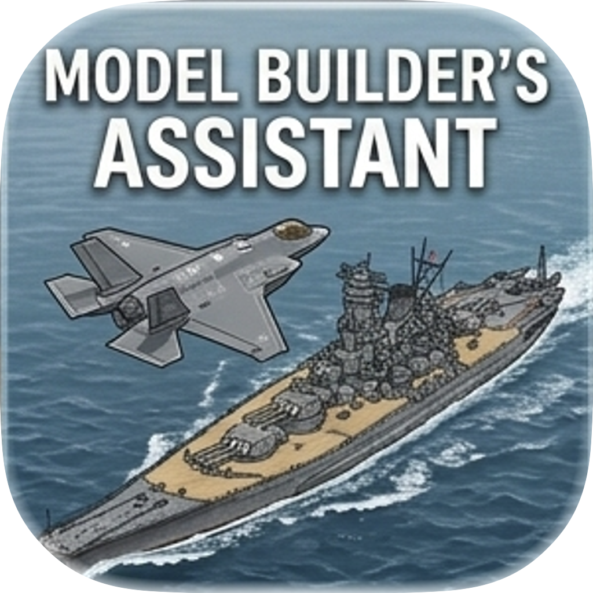

# Model Builder's Assistant

<p align="center">
  
</p>

<p align="center">
  A desktop companion app for scale model builders — manage your collection, follow instruction steps, and track your builds from box to shelf.
</p>

---

## What It Does

Model Builder's Assistant turns the often chaotic process of building scale models into something structured and trackable. Import your instruction PDFs, break them into individual steps, annotate them, and track your progress as you build.

### Instruction-Driven Builds

Import instruction PDFs and crop regions directly into build steps. Navigate your build visually — see exactly which part of the instructions you're on, annotate details, and mark steps complete as you go. The app supports page rotation, zoom, and a dedicated page-browsing mode alongside the step-based build view.

### Build Tracking

Organize builds into tracks (e.g., "Hull Assembly", "Painting", "Rigging") with ordered steps, sub-steps, and dependencies. Track completion with progress rings, log your work with timestamped entries and photos, set drying timers with OS notifications, and capture milestone moments along the way.

### Collection Management

Catalogue your kits, paints, and accessories in one place. Track what you own, what's on your wishlist, and what's assigned to which project. Paints include color family grouping, palette management, and per-step paint references so you always know which colors you need.

### Project Overview

Each project gets a dashboard with an assembly map showing all steps and their relationships, a photo gallery pulling from progress shots and milestones, a bill of materials, and a build log timeline.

<!-- ## Screenshots

TODO: Add screenshots here. Suggested captures:
- Collection view with kit cards
- Build view showing the three-panel layout (rail, canvas, step panel)
- PDF crop tool in action
- Overview dashboard with assembly map
-->

## Built With

- **[Tauri v2](https://tauri.app/)** — Rust backend + web frontend desktop app framework
- **[React 19](https://react.dev/)** + TypeScript — UI layer
- **[Zustand](https://zustand.docs.pmnd.rs/)** — State management
- **[Tailwind CSS v4](https://tailwindcss.com/)** + [shadcn/ui](https://ui.shadcn.com/) — Styling and components
- **[Konva.js](https://konvajs.org/)** — Canvas rendering for PDF pages, crop tools, and annotations
- **[rusqlite](https://github.com/rusqlite/rusqlite)** (SQLite) — Local database
- **[MuPDF](https://mupdf.com/)** — PDF rasterization

## Building from Source

### Prerequisites

- Node.js 18+
- Rust 1.70+
- CMake (required by MuPDF)
- Platform-specific Tauri dependencies ([see Tauri docs](https://v2.tauri.app/start/prerequisites/))

### Run

```bash
npm install
npm run tauri dev
```

### Production Build

```bash
npm run tauri build
```

## Project Status

Actively developed. See the [changelog](docs/CHANGELOG.md) for detailed release history.
